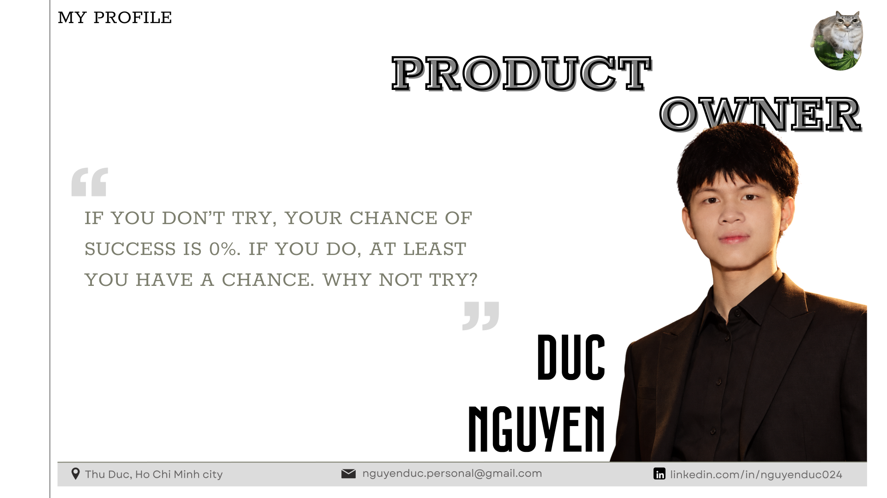

<div align="center">
  
```text
      /\_/\
     ( o.o )
      > ^ <
```
  
  

  <h1>Hi 👋, I'm Duc Nguyen</h1>
  <h3>Product Owner | Product Manager</h3>
  <p><i>"Translating business vision into valuable products."</i></p>
  
  <p>
    
  </p>
</div>

<br>

## 👾 About Me

I am passionate about **Product Management, Business Analysis, and User-Centric Design**. 
My goal is to bridge the gap between business needs and technical execution, delivering the highest value to users.

- **Core Focus:** Managing product lifecycles, gathering requirements (BRD/SRS), writing User Stories, and prioritizing backlogs.
- **Collaboration:** Strong advocate for Agile/Scrum frameworks to foster cross-functional team alignment.
- **Data-Driven:** Leveraging data analysis to iterate on product success.
- **Language:** Vietnamese (Native), English

---

## 🧰 Skills & Tools

**Product Management & Business Analysis:**
<br>


**UX/UI & Prototyping:**
<br>


**Data & Analytics:**
<br>


---

## 🐾 Relaxing Zone

<div align="center">
  
  <br>
  <p><i>Shh... the cat is inspecting the codebase.</i></p>
</div>

---

## ✉️ Let's Connect

[](https://www.linkedin.com/in/nguyenduc024/?isSelfProfile=true)
[](mailto:nguyenduc.personal@gmail.com)

<div align="center">
  <br>
  <p><i>Stay curious.</i></p>
</div>
